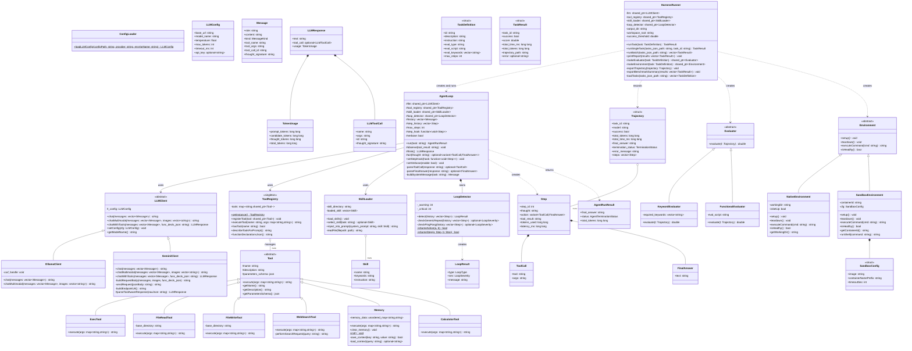

# CLASS DIAGRAM

```mermaid
classDiagram
    %% ===== LLM Client Layer =====
    class LLMClient {
        <<abstract>>
        #_config: LLMConfig
        +chat(messages: vector~Message~) string*
        +chatMultimodal(messages: vector~Message~, images: vector~string~) string*
        +chatWithTools(messages: vector~Message~, func_decls_json: string) LLMResponse
        +setConfig(cfg: LLMConfig) void
        +getModelName() string
    }
    class OllamaClient {
        -curl_handle: void*
        +chat(messages: vector~Message~) string
        +chatMultimodal(messages: vector~Message~, images: vector~string~) string
    }
    class GeminiClient {
        +chat(messages: vector~Message~) string
        +chatMultimodal(messages: vector~Message~, images: vector~string~) string
        +chatWithTools(messages: vector~Message~, func_decls_json: string) LLMResponse
        -buildRequestBody(messages, images, func_decls_json) string
        -sendRequest(jsonBody: string) string
        -buildEndpointUrl() string
        #parseToolAwareResponse(rawJson: string) LLMResponse
    }
    class ConfigLoader {
        +loadLLMConfig(configPath: string, provider: string, envVarName: string)$ LLMConfig
    }
    class LLMConfig {
        +base_url: string
        +model_name: string
        +temperature: float
        +max_tokens: int
        +timeout_ms: int
        +api_key: optional~string~
    }
    class Message {
        +role: string
        +content: string
        +kind: MessageKind
        +tool_name: string
        +tool_args: string
        +tool_call_id: string
        +thought_signature: string
    }
    class LLMToolCall {
        +name: string
        +args: string
        +id: string
        +thought_signature: string
    }
    class TokenUsage {
        +prompt_tokens: long long
        +candidate_tokens: long long
        +thought_tokens: long long
        +total_tokens: long long
    }
    class LLMResponse {
        +text: string
        +tool_call: optional~LLMToolCall~
        +usage: TokenUsage
    }
    LLMClient <|-- OllamaClient
    LLMClient <|-- GeminiClient
    LLMResponse *-- TokenUsage
    LLMResponse *-- LLMToolCall

    %% ===== Tool Layer =====
    class Tool {
        <<abstract>>
        #name: string
        #description: string
        #parameters_schema: json
        +execute(args: map~string,string~) string*
        +getName() string
        +getDescription() string
        +getParametersSchema() json
    }
    class ExecTool {
        +execute(args: map~string,string~) string
    }
    class FileReadTool {
        -base_directory: string
        +execute(args: map~string,string~) string
    }
    class FileWriteTool {
        -base_directory: string
        +execute(args: map~string,string~) string
    }
    class WebSearchTool {
        +execute(args: map~string,string~) string
        -performSearchRequest(query: string) string
    }
    class Memory {
        -memory_data: unordered_map~string,string~
        +execute(args: map~string,string~) string
        +clear_memory() void
        +init()$ void
        -save_context(key: string, value: string) bool
        -load_context(query: string) optional~string~
    }
    class CalculatorTool {
        +execute(args: map~string,string~) string
    }
    Tool <|-- ExecTool
    Tool <|-- FileReadTool
    Tool <|-- FileWriteTool
    Tool <|-- WebSearchTool
    Tool <|-- Memory
    Tool <|-- CalculatorTool

    class ToolRegistry {
        <<singleton>>
        -tools: map~string,shared_ptr~Tool~~
        +getInstance()$ ToolRegistry
        +registerTool(tool: shared_ptr~Tool~) void
        +executeTool(name: string, args: map~string,string~) string
        +hasTool(name: string) bool
        +describeToolsForPrompt() string
        +functionDeclarationsJson() string
    }
    ToolRegistry o-- "many" Tool : manages

    %% ===== Skill Layer =====
    class SkillLoader {
        -skill_directory: string
        -loaded_skill: vector~Skill~
        +load_skills() void
        +select_skill(task: string) optional~Skill~
        +inject_into_prompt(system_prompt: string, skill: Skill) string
        -readFile(filepath: path) string
    }
    class Skill {
        +name: string
        +keywords: string
        +instruction: string
    }
    SkillLoader o-- "many" Skill

    %% ===== Agent Loop / Action / Step =====
    class ToolCall {
        +tool: string
        +args: string
    }
    class FinalAnswer {
        +text: string
    }
    class Step {
        +step_id: int
        +thought: string
        +action: variant~ToolCall,FinalAnswer~
        +tool_result: string
        +tokens_used: long long
        +latency_ms: long long
    }
    Step *-- ToolCall
    Step *-- FinalAnswer

    class LoopDetector {
        -_warning: int
        -_critical: int
        +detect(history: vector~Step~) LoopResult
        -checkGenericRepeat(history: vector~Step~) optional~LoopSeverity~
        -checkPingPong(history: vector~Step~) optional~LoopSeverity~
        -isSameAction(a, b)$ bool
        -isSameStep(a: Step, b: Step)$ bool
    }
    class LoopResult {
        +type: LoopType
        +sev: LoopSeverity
        +message: string
    }
    LoopDetector ..> LoopResult : creates

    class AgentRunResult {
        +final_answer: string
        +status: AgentTerminationStatus
        +total_tokens: long long
    }

    class AgentLoop {
        #llm: shared_ptr~LLMClient~
        #tool_registry: shared_ptr~ToolRegistry~
        #skill_loader: shared_ptr~SkillLoader~
        #loop_detector: shared_ptr~LoopDetector~
        #history: vector~Message~
        #step_history: vector~Step~
        #max_steps: int
        #step_hook: function~void~Step~~
        #verbose: bool
        +run(task: string) AgentRunResult
        #observe(tool_result: string) void
        #think() LLMResponse
        #act(thought: string) optional~variant~ToolCall,FinalAnswer~~
        +setStepHook(hook: function~void~Step~~) void
        +setVerbose(enable: bool) void
        -parseToolCall(response: string) optional~ToolCall~
        -parseFinalAnswer(response: string) optional~FinalAnswer~
        -buildSystemMessage(task: string) Message
    }
    AgentLoop --> LLMClient : uses
    AgentLoop --> ToolRegistry : uses
    AgentLoop --> SkillLoader : uses
    AgentLoop *-- LoopDetector : owns
    AgentLoop ..> Step : creates
    AgentLoop ..> AgentRunResult : returns

    %% ===== Environment =====
    class Environment {
        <<abstract>>
        +setup() void*
        +teardown() void*
        +executeCommand(cmd: string) string*
        +isHealthy() bool*
    }
    class SandboxConfig {
        <<struct>>
        +image: string
        +containerNamePrefix: string
        +timeoutSec: int
    }
    class NativeEnvironment {
        -workingDir: string
        -isSetUp: bool
        +setup() void
        +teardown() void
        +executeCommand(cmd: string) string
        +isHealthy() bool
        +getWorkingDir() string
    }
    class SandboxEnvironment {
        -containerId: string
        -cfg: SandboxConfig
        +setup() void
        +teardown() void
        +executeCommand(cmd: string) string
        +isHealthy() bool
        +getContainerId() string
        -runShell(command: string) string
    }
    Environment <|-- NativeEnvironment
    Environment <|-- SandboxEnvironment
    SandboxEnvironment *-- SandboxConfig

    %% ===== Trajectory =====
    class Trajectory {
        <<struct>>
        +task_id: string
        +model: string
        +success: bool
        +total_tokens: long long
        +total_time_ms: long long
        +final_answer: string
        +termination_status: TerminationStatus
        +error_message: string
        +steps: vector~Step~
    }
    Trajectory o-- "many" Step

    %% ===== Evaluator =====
    class Evaluator {
        <<abstract>>
        +evaluate(t: Trajectory) double*
    }
    class KeywordEvaluator {
        -required_keywords: vector~string~
        +evaluate(t: Trajectory) double
    }
    class FunctionalEvaluator {
        -eval_script: string
        +evaluate(t: Trajectory) double
    }
    Evaluator <|-- KeywordEvaluator
    Evaluator <|-- FunctionalEvaluator

    %% ===== Harness =====
    class TaskDefinition {
        <<struct>>
        +id: string
        +description: string
        +instruction: string
        +eval_type: string
        +eval_script: string
        +eval_keywords: vector~string~
        +max_steps: int
    }
    class TaskResult {
        <<struct>>
        +task_id: string
        +success: bool
        +score: double
        +total_time_ms: long long
        +total_tokens: long long
        +trajectory_path: string
        +error: optional~string~
    }
    class HarnessRunner {
        -llm: shared_ptr~LLMClient~
        -tool_registry: shared_ptr~ToolRegistry~
        -skill_loader: shared_ptr~SkillLoader~
        -loop_detector: shared_ptr~LoopDetector~
        -output_dir: string
        -workspace_root: string
        -success_threshold: double
        +runTask(task: TaskDefinition) TaskResult
        +runSingleTask(tasks_json_path: string, task_id: string) TaskResult
        +runBatch(tasks_json_path: string) vector~TaskResult~
        +printReport(results: vector~TaskResult~) void
        -makeEvaluator(task: TaskDefinition) shared_ptr~Evaluator~
        -makeEnvironment(task: TaskDefinition) shared_ptr~Environment~
        -exportTrajectory(trajectory: Trajectory) void
        -exportBenchmarkSummary(results: vector~TaskResult~) void
        -loadTasks(tasks_json_path: string) vector~TaskDefinition~
    }
    HarnessRunner ..> AgentLoop : creates and runs
    HarnessRunner ..> Trajectory : records
    HarnessRunner ..> Evaluator : creates
    HarnessRunner ..> Environment : creates

```
