# COMPONENT DIAGRAM — Tổng quan các module & dependency

Kiến trúc phân lớp (layered architecture) của framework `OopAgent`:

- **Entry Points** — nạp config, đăng ký tool, chọn chế độ chạy.
- **Agent Core** — vòng lặp ReAct, phát hiện loop, chọn skill.
- **LLM Client Layer** — giao tiếp API Gemini/Ollama + embedding.
- **Tool Layer** — registry (singleton) + các tool cụ thể.
- **Harness Layer** — điều phối benchmark, environment, evaluator, multi-agent.
- **Runtime artifacts** — dataset, skill markdown, output JSON, workspace.

Chiều mũi tên = chiều dependency (`A → B`: A phụ thuộc B).

```mermaid
flowchart TB
    %% ═══════════════════════ LAYERS ═══════════════════════
    subgraph ENTRY["🖥️ Entry Points (binaries)"]
        MAIN["main.cpp<br/>agent_run"]
        MULTI["demo_multi_agent.cpp<br/>demo_multi_agent"]
        RUN_EVAL["run_eval.cpp<br/>benchmark_run"]
        TESTS["tests/*.cpp<br/>ctest"]
    end

    subgraph AGENT["agent/ — Agent Core"]
        AGENTLOOP["AgentLoop<br/>(ReAct: think → act → observe)"]
        LOOPDET["LoopDetector"]
        SKILLLOAD["SkillLoader"]
    end

    subgraph CLIENT["client/ — LLM Client Layer"]
        CFG["ConfigLoader"]
        LLMCLIENT["LLMClient (abstract)"]
        GEMINI["GeminiClient"]
        OLLAMA["OllamaClient"]
        EMBED["EmbeddingClient (abstract)"]
        OLLAMA_EMBED["OllamaEmbeddingClient"]
    end

    subgraph TOOLS["tools/ — Tool Layer"]
        REGISTRY["ToolRegistry<br/>(Singleton)"]
        T_CALC["CalculatorTool"]
        T_EXEC["ExecTool"]
        T_READ["FileReadTool"]
        T_WRITE["FileWriteTool"]
        T_MEM["Memory"]
        T_WEB["WebSearchTool"]
        T_DATETIME["DateTimeTool"]
        T_HTTP["HttpGetTool"]
        T_JSON["JsonParserTool"]
    end

    subgraph HARNESS["harness/ — Benchmark & Coordination"]
        HR["HarnessRunner"]
        ENV_ABS["Environment (abstract)"]
        ENV_NATIVE["NativeEnvironment"]
        ENV_SANDBOX["SandboxEnvironment"]
        EVAL_ABS["Evaluator (abstract)"]
        EVAL_KEY["KeywordEvaluator"]
        EVAL_FUNC["FunctionalEvaluator"]
        TRAJ["Trajectory / Step"]
        COORD["MultiAgentCoordinator"]
    end

    subgraph ASSETS["🗂️ Runtime Artifacts"]
        SKILLS_MD["src/skills/*.md"]
        TASK_JSON["src/benchmark/task.json"]
        CONFIG["config.json"]
        RESULTS["results/<br/>trajectory_*.json<br/>benchmark_summary.json"]
        WORKSPACE["workspace/task_*/"]
    end

    subgraph EXTERNAL["🌐 External Systems"]
        API_GEMINI["Google Gemini API<br/>(function calling)"]
        API_OLLAMA["Ollama API<br/>(chat + /api/embed)"]
        DDG["DuckDuckGo API<br/>(web_search)"]
        LIBS["libcurl / nlohmann-json<br/>zlib / sqlite3"]
    end

    %% ═══════════════════════ Entry → modules ═══════════════════════
    MAIN --> AGENTLOOP
    MAIN --> HR
    RUN_EVAL --> HR
    MAIN --> CFG
    RUN_EVAL --> CFG
    MAIN --> REGISTRY
    RUN_EVAL --> REGISTRY
    MULTI --> HR
    MULTI --> COORD
    MULTI --> REGISTRY
    MULTI --> CFG

    %% ═══════════════════════ Agent Core ═══════════════════════
    AGENTLOOP --> LLMCLIENT
    AGENTLOOP --> REGISTRY
    AGENTLOOP --> LOOPDET
    AGENTLOOP --> SKILLLOAD
    SKILLLOAD --> SKILLS_MD

    %% ═══════════════════════ Client layer ═══════════════════════
    GEMINI --> LLMCLIENT
    OLLAMA --> LLMCLIENT
    OLLAMA_EMBED --> EMBED
    GEMINI --> API_GEMINI
    OLLAMA --> API_OLLAMA
    OLLAMA_EMBED --> API_OLLAMA

    %% ═══════════════════════ Tool layer ═══════════════════════
    REGISTRY --> T_CALC
    REGISTRY --> T_EXEC
    REGISTRY --> T_READ
    REGISTRY --> T_WRITE
    REGISTRY --> T_MEM
    REGISTRY --> T_WEB
    REGISTRY --> T_DATETIME
    REGISTRY --> T_HTTP
    REGISTRY --> T_JSON
    T_MEM --> EMBED
    T_WEB --> DDG

    %% ═══════════════════════ Harness layer ═══════════════════════
    HR --> AGENTLOOP
    HR --> LLMCLIENT
    HR --> REGISTRY
    HR --> ENV_ABS
    HR --> EVAL_ABS
    HR --> TRAJ
    HR --> COORD
    HR --> TASK_JSON
    HR --> RESULTS
    HR --> WORKSPACE
    ENV_NATIVE --> ENV_ABS
    ENV_SANDBOX --> ENV_ABS
    EVAL_KEY --> EVAL_ABS
    EVAL_FUNC --> EVAL_ABS
    EVAL_FUNC --> ENV_ABS
    COORD --> AGENTLOOP

    %% Exceptions được client layer propagate lên
    LLMCLIENT -. "llm_client.h: LLMException / APIEnvironmentError / LLMClientError" .-> AGENTLOOP

    %% ═══════════════════════ Config & libs ═══════════════════════
    CFG --> CONFIG
    LLMCLIENT -.-> LIBS
    REGISTRY -.-> LIBS
    HR -.-> LIBS
```

---

## Ma trận dependency theo module

| Module | Phụ thuộc | Trách nhiệm chính |
| --- | --- | --- |
| `agent/` | `client/` (LLMClient), `tools/` (ToolRegistry), `harness/` (Trajectory), `skills/` | ReAct loop, loop detection, skill selection |
| `client/` | libcurl, nlohmann/json, Gemini/Ollama API | Gọi LLM, parse response, embedding search |
| `tools/` | `client/` (EmbeddingClient), DuckDuckGo, exec | 9 tool có thể gọi từ LLM; ToolRegistry singleton |
| `harness/` | `agent/`, `client/`, `tools/`, `benchmark/task.json`, filesystem | Điều phối benchmark, chấm điểm, multi-agent |
| `benchmark/` | harness (qua `run_eval.cpp`) | Dataset 20 task: 10 functional + 10 keyword |
| `main.cpp` | tất cả các module | Single-Agent REPL interactive + CLI flags |
| `demo_multi_agent.cpp` | `client/`, `tools/`, `agent/`, `harness/` | Multi-Agent Interactive REPL & CLI parallel runner |

## Cách đọc component diagram

1. **Luồng chính đơn agent**: `MAIN → AgentLoop → LLMClient → ToolRegistry → Tool`.
2. **Luồng benchmark**: `RUN_EVAL/MAIN → HarnessRunner → AgentLoop` (+ hook thu thập `Trajectory`) `→ Evaluator`, viết ra `results/`.
3. **Observer/Hook**: `AgentLoop` gọi `step_hook` (do `HarnessRunner` inject) → `Trajectory` — Agent **không** phụ thuộc vào Harness.
4. **Cách ly lỗi**: mỗi task có `NativeEnvironment` riêng (`workspace/task_XXX/`); 1 task fail không sập cả batch.
