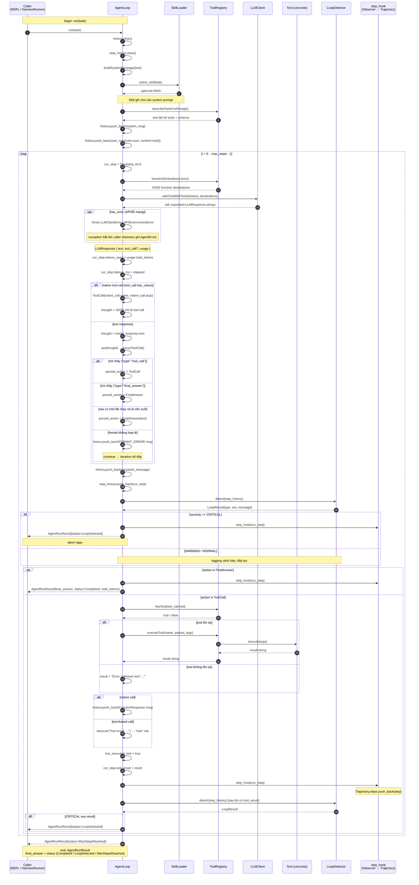

# SEQUENCE DIAGRAM — Một lần Agent Run hoàn chỉnh

Mô tả luồng thực thi đầy đủ **một lần `AgentLoop::run(task)`** từ khi *nhận task*
đến khi *trả kết quả* (`AgentRunResult`). Đây là lõi ReAct loop được dùng chung bởi
cả chế độ REPL (`main.cpp`) lẫn Benchmark (`HarnessRunner`).

---

## Happy Path: tool call → … → final answer

---

## Luồng rút gọn theo trạng thái kết thúc

| Điều kiện | `AgentRunResult.status` |
| --- | --- |
| Model trả `final_answer` JSON (hoặc văn xuôi sau khi đã chạy tool) | `Completed` |
| `LoopDetector` báo `CRITICAL` (GenericRepeat ≥ 4 lần giống hệt, hoặc PingPong ≥ 4 cặp) | `LoopDetected` |
| Vòng lặp chạy đủ `max_steps` mà chưa có final answer | `MaxStepsReached` |
| `safeChatWithTools` → `std::unexpected` (API key / mạng / rate-limit) | ném exception → caller map sang `AgentError` |

> Ghi chú triển khai (`src/agent/agent_loop.cpp`): `step_hook` là `std::function`.
> Ở chế độ REPL không set hook; ở chế độ benchmark `HarnessRunner` set hook để
> *thu thập* `Step` vào `Trajectory` mà không can thiệp logic agent.