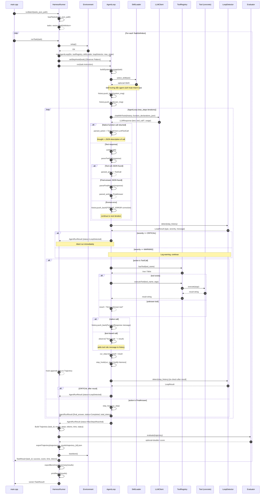

# SEQUENCE DIAGRAM – Agent Run Flow

Mô tả luồng thực thi đầy đủ từ khi `HarnessRunner::runTask()` được gọi đến khi trả về `TaskResult`.

---

## Sơ đồ tổng thể (Happy Path – Tool Call → Final Answer)

