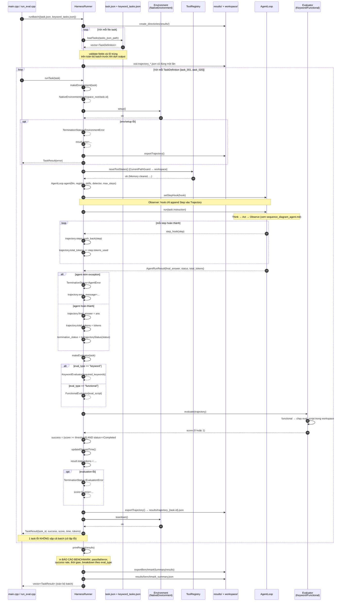

# SEQUENCE DIAGRAM — HarnessRunner chạy Batch Evaluation

Mô tả pipeline benchmark từ khi `HarnessRunner::runBatch(task_files)` được gọi
đến khi xuất `benchmark_summary.json` và trả về toàn bộ `TaskResult`.
Sơ đồ này cho thấy vai trò *Director* của HarnessRunner: nó chỉ NỐI các layer
(Environment → AgentLoop → Trajectory → Evaluator) mà không chứa logic suy luận.

---

---

## Chi tiết `runTask()` — các trạng thái lỗi có thể xảy ra

| Giai đoạn | Trạng thái `TerminationStatus` | Kết quả `TaskResult` |
| --- | --- | --- |
| `makeEnvironment` / `env->setup()` thất bại | `EnvironmentError` | `error="Loi tao moi truong: ..."` |
| `agent.run()` ném exception | `AgentError` | `success=false, score=0, error=...` |
| `evaluate()` ném exception | `EvaluationError` | `success=false, score=0, error=...` |
| Không lỗi nhưng score < `success_threshold` (mặc định 1.0) hoặc status ≠ Completed | trạng thái gốc | `success=false` |
| Hoàn thành đúng | `Completed` | `success=true, score=1` |

- Các task bị lỗi vẫn export `trajectory_<id>.json` (qua `safelyExportTrajectory`).
- Teardown luôn chạy trong `finally`-style (try/catch riêng), dù pass hay fail.
- Ngưỡng thành công có thể cấu hình khi khởi tạo `HarnessRunner` (mặc định `1.0`).
