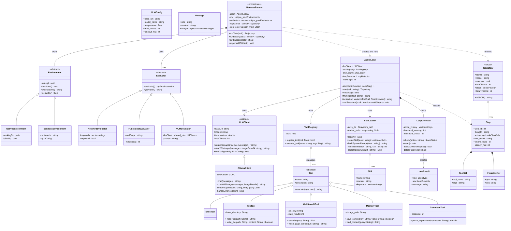

### CLASS DIAGRAM 

```mermaid
classDiagram
    %% ===== LLM Client Layer =====
    class LLMClient {
        <<abstract>>
        #baseUrl: string
        #model: string
        #temperature: double
        #maxTokens: int
        +chat(messages: vector~Message~) string*
        +chatWithImage(messages, imageBase64: string) string*
        +setConfig(config: LLMConfig) void
    }
    class OllamaClient {
        -curlHandle: CURL*
        +chat(messages) string
        +chatWithImage(messages, imageBase64) string
        -sendPost(endpoint: string, body: json) json
        -handleError(code: int) void
    }
    class LLMConfig {
        +base_url : string
        +model_name : string
        +temperature : float
        +max_tokens : int
        +timeout_ms : int
    }
    class Message {
        +role : string
        +content : string
        +images : optional~vector~string~~
    }
    LLMClient <|-- OllamaClient

    %% ===== Tool Layer =====
    class Tool {
        <<abstract>>
        +name: string
        +description: string
        +execute (args: map) string
    }
    class ExecTool
    class FileTool {
        - base_directory: String
        + read_file(path: String) String
        + write_file(path: String, content: String) boolean
    }
    class WebSearchTool  {
        - api_key: String
        - max_results: int
        + search(query: String) List
        + fetch_page_content(url: String) String
    }
    class MemoryTool {
        - storage_path: String
        + save_context(key: String, value: String) boolean
        + load_context(query: String) String
    }
    class CalculatorTool {
        - precision: int
        + parse_expression(expression: String) double
    }
    Tool <|-- ExecTool
    Tool <|-- FileTool
    Tool <|-- WebSearchTool
    Tool <|-- MemoryTool
    Tool <|-- CalculatorTool

    class ToolRegistry {
        - tools: map
        + register_tool(tool: Tool) bool
        + execute_tool(name: string, args: Map) string
    }
    ToolRegistry o-- "many" Tool : manages

    %% ===== Skill Layer =====
    class SkillLoader {
       -skills_dir : filesystem_path
        -loaded_skills : map~string, Skill~
        +loadAll() void
        +selectSkill(task : string) optional~Skill~
        +buildSystemPrompt(task : string) string
        -matchScore(task : string, skill : Skill) int
        -parseMarkdown(path : string) Skill
    }
    class Skill {
        +name : string
        +content : string
        +keywords : vector~string~
    }
    SkillLoader o-- "many" Skill

    %% ===== Agent Loop / Action / Step =====
    class ToolCall {
        +tool_name : string
        +args : string
    }
    class FinalAnswer {
        +type: string
        +text: string
    }
    class Step {
        +step_id : int
        +thought : string
        +action : optional~ToolCall~
        +tool_result : string
        +tokens_used : int
        +latency_ms : int
    }
    Step *-- ToolCall
    Step *-- FinalAnswer

    class LoopDetector {
        -action_history : vector~string~
        -threshold_warning : int
        -threshold_critical : int
        +check(action : string) LoopStatus
        +reset() void
        -detectGenericRepeat() bool
        -detectPingPong() bool
    }
    class LoopResult {
        +type: LoopType
        +sev: LoopSeverity
        +message: string
    }
    LoopDetector ..> LoopResult : creates

    class AgentLoop {
        -llmClient: LLMClient*
        -toolRegistry: ToolRegistry*
        -skillLoader: SkillLoader*
        -loopDetector: LoopDetector
        -maxSteps: int
        -stepHook: function~void(Step)~
        +run(task: string) Trajectory
        #observe() Step
        #think(context: string) string
        #act(action: variant~ToolCall, FinalAnswer~) string
        +setStepHook(hook: function~void(Step)~) void
    }
    AgentLoop --> LLMClient : uses
    AgentLoop --> ToolRegistry : uses
    AgentLoop --> SkillLoader : uses
    AgentLoop *-- LoopDetector : owns
    AgentLoop ..> Step : creates

    %% ===== Environment =====
    class Environment {
        <<abstract>>
        +setup() void*
        +teardown() void*
        +execute(cmd) string*
        +isHealthy() bool*
    }
    class NativeEnvironment {
        -workingDir : path
        -isSetUp : bool
    }
    class SandboxEnvironment {
        -containerId : string
        -cfg : Config
    }
    Environment <|-- NativeEnvironment
    Environment <|-- SandboxEnvironment

    %% ===== Trajectory =====
    class Trajectory {
        <<struct>>
        +taskId : string
        +model : string
        +success : bool
        +totalTokens : int
        +steps : vector~Step~
        +totalTimems : int
        +toJSON() string
    }
    Trajectory o-- "many" Step

    %% ===== Evaluator =====
    class Evaluator {
        <<abstract>>
        +evaluate(t) optional~double~*
        +getName() string*
        
    }
    class KeywordEvaluator {
        -keywords : vector~string~
        -requireAll : bool
    }
    class FunctionalEvaluator {
        -evalScript : string
        -runScript() int
    }

    class VLMEvaluator {
        -llmClient : shared_ptr~LLMClient~
        -prompt : string
    }
    Evaluator <|-- KeywordEvaluator
    Evaluator <|-- FunctionalEvaluator
    Evaluator <|-- VLMEvaluator

    %% ===== Harness =====
    class HarnessRunner {
        <<orchestrator>>
        -agent : AgentLoop&
        -env : unique_ptr~Environment~
        -evaluators : vector~unique_ptr~Evaluator~~
        -trajectories : vector~Trajectory~
        -stepHook : function~void_Step~
        +runTask(task) Trajectory
        +runBatch(tasks) vector~Trajectory~
        +getSuccessRate() float
        +exportAllJSON(dir) void
    }
    HarnessRunner *-- Environment : owns
    HarnessRunner o-- "many" Evaluator : uses
    HarnessRunner ..> AgentLoop : creates and runs
    HarnessRunner ..> Trajectory : records

```