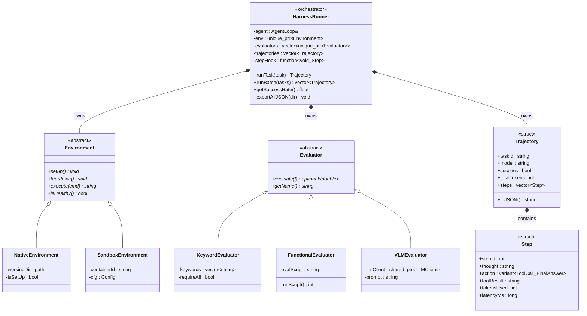

# Class Diagram — Harness Subsystem

## Quan hệ giữa các class

| Quan hệ | Ký hiệu | Ý nghĩa |
|---|---|---|
| `Environment <\|-- Native/SandboxEnvironment` | Inheritance | Override toàn bộ pure virtual của `Environment` |
| `Evaluator <\|-- Keyword/Functional/VLMEvaluator` | Inheritance | Strategy Pattern — 3 thuật toán chấm điểm |
| `Trajectory *-- Step` | Composition | `Trajectory` sở hữu `vector<Step>` |
| `HarnessRunner *-- Environment` | Composition | Sở hữu qua `unique_ptr`, đổi impl không cần sửa `HarnessRunner` |
| `HarnessRunner *-- Evaluator` | Composition | Sở hữu nhiều evaluator, chạy tuần tự |
| `HarnessRunner *-- Trajectory` | Composition | Tích lũy kết quả sau mỗi `runTask()` |

## Design Patterns

| Pattern | Class áp dụng |
|---|---|
| **Strategy** | `Evaluator` → `KeywordEvaluator`, `FunctionalEvaluator`, `VLMEvaluator` |
| **Template Method** | `HarnessRunner::runTask()` — skeleton cố định |
| **Observer / Hook** | `stepHook` inject vào `AgentLoop` |
| **Dependency Inversion** | `HarnessRunner` phụ thuộc `Environment` abstract, không phụ thuộc concrete |
