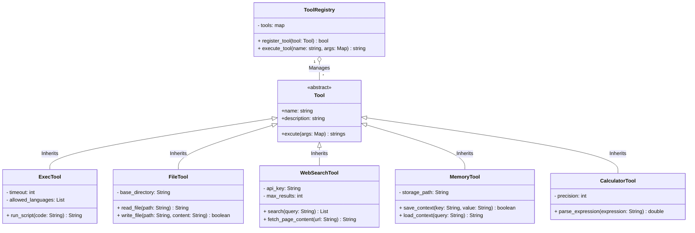

# Thiết kế Class Diagram cho hệ thống Tool 
> **Người thực hiện:** Nguyễn Ngọc Anh Thư - 25127151

---
## 1. Tổng quan (Overview)
*Mô tả các Tools Agent.*
## 2. Sơ đồ lớp (Class Diagram)

```mermaid
classDiagram
    %% Top to Bottom: class cha/ class quản lí nằm phía trên các class con
    direction TB
    class ToolRegistry {
        - tools: map
        + register_tool(tool: Tool) bool
        + execute_tool(name: string, args: Map) string
    }
    class Tool {
        <<abstract>>
        +name: string
        +description: string
        +excute (args: Map) strings
    }

    %% Các bộ công cụ thực thi kế thừa từ Tool
    class ExecTool {- timeout: int
        - allowed_languages: List
        + run_script(code: String) String
    }
   class FileTool {
        - base_directory: String
        + read_file(path: String) String
        + write_file(path: String, content: String) boolean
    }

    class WebSearchTool {
        - api_key: String
        - max_results: int
        + search(query: String) List
        + fetch_page_content(url: String) String
    }

    class MemoryTool {
        - storage_path: String
        + save_context(key: String, value: String) boolean
        + load_context(query: String) String
    }

    class CalculatorTool {
        - precision: int
        + parse_expression(expression: String) double
    }
    %% Mối quan hệ giữa các Class
    ToolRegistry "1" o-- "*" Tool : Manages
    Tool <|-- ExecTool : Inherits
    Tool <|-- FileTool : Inherits
    Tool <|-- WebSearchTool : Inherits
    Tool <|-- MemoryTool : Inherits
    Tool <|-- CalculatorTool : Inherits
```
