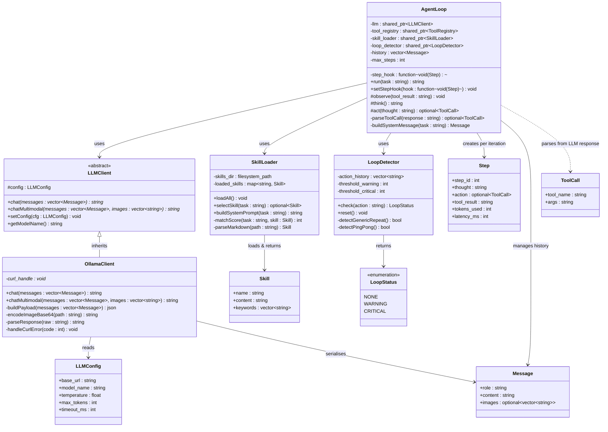

## CLASS DIAGRAM:
Thiết kế class diagram                                      --LoopDetector
-AgentLoop (core ReAct loop)
-LLMClient (abstract) <- OllamaClient
-SkillLoader

```mermaid
classDiagram

    class Message {
        +role : string
        +content : string
        +images : optional~vector~string~~
    }

    class LLMConfig {
        +base_url : string
        +model_name : string
        +temperature : float
        +max_tokens : int
        +timeout_ms : int
    }

    class ToolCall {
        +tool_name : string
        +args : string
    }

    class Skill {
        +name : string
        +content : string
        +keywords : vector~string~
    }

    class LoopStatus {
        <<enumeration>>
        NONE
        WARNING
        CRITICAL
    }

    class Step {
        +step_id : int
        +thought : string
        +action : optional~ToolCall~
        +tool_result : string
        +tokens_used : int
        +latency_ms : int
    }


    class LLMClient {
        <<abstract>>
        #config : LLMConfig
        +chat(messages : vector~Message~) string*
        +chatMultimodal(messages : vector~Message~, images : vector~string~) string*
        +setConfig(cfg : LLMConfig) void
        +getModelName() string
    }

    class OllamaClient {
        -curl_handle : void*
        +chat(messages : vector~Message~) string
        +chatMultimodal(messages : vector~Message~, images : vector~string~) string
        -buildPayload(messages : vector~Message~) json
        -encodeImageBase64(path : string) string
        -parseResponse(raw : string) string
        -handleCurlError(code : int) void
    }

    LLMClient <|-- OllamaClient : inherits

    class SkillLoader {
        -skills_dir : filesystem_path
        -loaded_skills : map~string, Skill~
        +loadAll() void
        +selectSkill(task : string) optional~Skill~
        +buildSystemPrompt(task : string) string
        -matchScore(task : string, skill : Skill) int
        -parseMarkdown(path : string) Skill
    }

    class LoopDetector {
        -action_history : vector~string~
        -threshold_warning : int
        -threshold_critical : int
        +check(action : string) LoopStatus
        +reset() void
        -detectGenericRepeat() bool
        -detectPingPong() bool
    }

 
    class AgentLoop {
        -llm : shared_ptr~LLMClient~
        -tool_registry : shared_ptr~ToolRegistry~
        -skill_loader : shared_ptr~SkillLoader~
        -loop_detector : shared_ptr~LoopDetector~
        -history : vector~Message~
        -max_steps : int
        -step_hook : function~void(Step)~
        +run(task : string) string
        +setStepHook(hook : function~void(Step)~) void
        #observe(tool_result : string) void
        #think() string
        #act(thought : string) optional~ToolCall~
        -parseToolCall(response : string) optional~ToolCall~
        -buildSystemMessage(task : string) Message
    }

    
   

    AgentLoop --> LLMClient          : uses 
    AgentLoop --> SkillLoader        : uses 
    AgentLoop --> LoopDetector       : uses
    AgentLoop --> Step               : creates per iteration
    AgentLoop --> Message            : manages history
    AgentLoop ..> ToolCall           : parses from LLM response

    OllamaClient --> LLMConfig       : reads
    OllamaClient --> Message         : serialises

    SkillLoader --> Skill            : loads & returns
    LoopDetector --> LoopStatus      : returns

```
